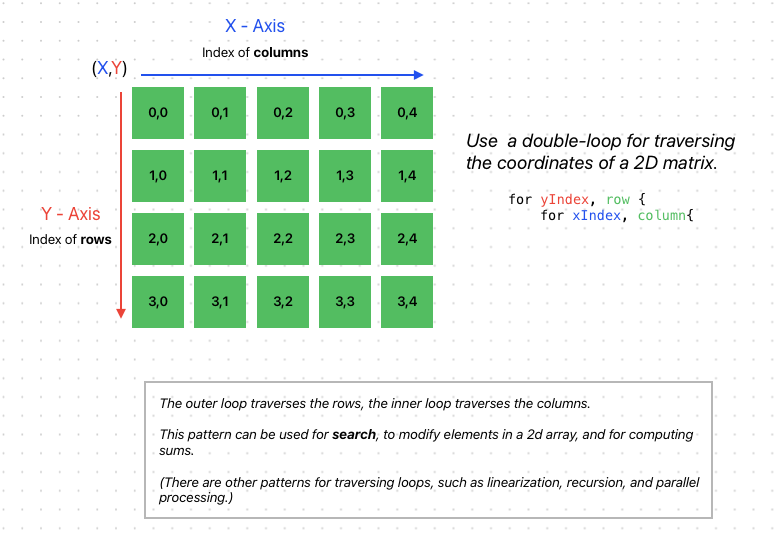

# OpenPair: Golang 04 - Get The Cheese


## Mouse Maze Game

### Overview

Mouse Maze is a simple console-based game written in Go. In this game, players navigate a mouse through a maze to find cheese. The game is played in the terminal and uses basic character representations for the maze, mouse, and cheese.

### How to Play

- Your goal is to move the mouse to the cheese.
- Use WASD keys for movement:
  - `W`: Move up
  - `A`: Move left
  - `S`: Move down
  - `D`: Move right
- The game ends when you successfully guide the mouse to the cheese.

### Features

- Simple maze structure with a static layout.
- Console-based user interface.
- Basic keyboard input to control the mouse.
- Clear screen functionality for a smooth gaming experience.

### 2D Matrix Traversal

The game uses a 2D matrix to represent the maze. The matrix is a 2D array of characters. Each character represents a cell in the maze. Navigating the matrix involves moving the mouse to a new cell by changing its X and Y coordinates.



### Requirements

- Go programming language
- A terminal that can execute Go programs

### Installation and Running the Game

1. Ensure that Go is installed on your system.
2. Clone or download the source code from this repository.
3. Navigate to the directory containing the game's source code.
4. Run the game using the command: `go run main.go`

### Game Structure

- `Mouse` struct: Represents the player's character with X, Y coordinates.
- `Maze` struct: Represents the game maze with a grid layout.
- `main`: The main function sets up the game loop and handles user input.
- `clearScreen`: Clears the terminal screen for a cleaner display.
- `createMaze`: Initializes the maze with a predefined layout.
- `printMaze`: Renders the maze and the mouse's position in the terminal.
- `handleInput`: Handles player's keyboard input to control the mouse's movement.

### Running the Code

To run the main program, execute the following in your terminal:

```bash
go run main.go
```

### Useful Resources For Learning Go

In addition to the resources provided in the first tutorial, here are some more to deepen your understanding of Go:

- [GoLang-Book](https://www.golang-book.com/books/intro): A free online book that covers the basics of Go.
- [Go Blog](https://blog.golang.org/): Official Go blog with articles on best practices, new features, and community insights.
- [Go Wiki](https://github.com/golang/go/wiki): A collection of resources and community-contributed information.
- [Go Modules](https://blog.golang.org/using-go-modules): Understanding Go's dependency management system.
- [Advanced Go Programming](https://advancedgolang.com/): Resources and articles for more experienced Go developers.
- [GoLang Docs](https://golangdocs.com/): A collection of Go tutorials and articles.
